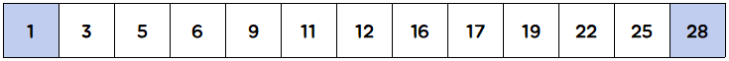

# 투 포인터, 슬라이딩 윈도우(Sliding Window)

## 투 포인터

**투 포인터**는 정렬된 배열에서 두 개의 포인터(인덱스)를 이용하여 해당 값들과 원하는 값을 비교한 뒤 포인터를 조작하여 원하는 결과를 얻어내는 기법이다.

대표적인 예로 '배열 내 합이 S가 되는 순서쌍 찾기'가 있다.


이중 반복문 사용으로 배열 내 합이 S가 되는 순서쌍 찾기

```c++
for (int i = 0; i < n; ++i)
    for (int j = i + 1; j < n; ++j)
        if (seq[i] + seq[j] == S)
            cout << seq[i] << '+' << seq[j] << '=' << S << '\n';
```

이중 반복문을 사용하는 경우 O(N<sup>2</sup>)의 시간이 걸리므로 데이터가 크면 클수록 시간 초과가 발생할 가능성이 매우 높아진다.


하지만 투 포인터를 이용하면 정렬되지 않은 배열의 경우 O(NlogN), 이미 정렬된 배열의 경우 O(N) 시간에 이러한 순서쌍들을 찾을 수 있다.




두 개의 포인터를 이용하여 양 끝 지점을 가리킨다. 왼쪽 끝의 포인터를 l, 오른쪽 끝의 포인터를 r이라고 하자.


l ≤ r을 만족하는 동안 다음과 같은 작업을 반복한다.

* 두 개의 포인터가 가리키고 있는 원소의 합이 S보다 큰 경우 r을 감소시킨다.
* 두 개의 포인터가 가리키고 있는 원소의 합이 S보다 작은 경우 l을 증가시킨다.
* 두 개의 포인터가 가리키고 있는 원소의 합이 S와 같다면 l을 증가시키고 r을 감소시키거나 작업을 종료한다.


첫 번째 경우 두 원소의 합이 S보다 크기 때문에 오름차순으로 정렬된 배열에서 r을 감소시킨다면 그 값이 작아지게 된다.

두 번째 경우, 두 원소의 합이 S보다 작기 때문에 오름차순으로 정렬된 배열에서 l을 증가시킨다면 그 값이 커지게 된다.

세 번째 경우에서 어떠한 답을 출력하건 상관없다면 작업을 종료해도 무방하지만, 특정한 조건에 맞는 답을 구하거나 (예를 들면 중복된 원소가 있는지 등) 모든 경우의 수를 구해야 한다면 경우에 맞는 적절한 작업을 해줘야 한다.


---


N개의 중복 없는 원소를 입력받아 합이 S가 되는 순서쌍의 개수를 찾는 코드

```c++
#include<vector>
#include<iostream>
#include<algorithm>
using namespace std;
int main(){
	int n, s; cin >> n >> s;
	vector<int> seq(n);
	
	for(int i = 0; i<n; ++i)
		cin >> seq[i];
	
	sort(seq.begin(), seq.end());
	
	int l = 0, r = n - 1, ans = 0;
	
	while(l <= r){
		int sum = seq[l] + seq[r];
		if(sum > s) --r;
		else if(sum < s) ++l;
		else{
			++l; --r; ++ans;
		}
	}
	cout << ans;
}
```

